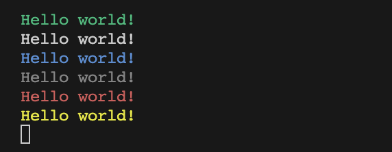

# @bunlyfans/log


Simple and colorful logger for your Bun project!



## Installation

```bash
bun add @bunlyfans/log
```

## Usage

As everything in Bun - it just works out of the box. You only need to import it once:

```typescript
import '@bunlyfans/log/global';
```

And use across the app:

```typescript
log.s('Hello world!'); // short for log.success
log.o('Hello world!'); // short for log.ok (alias for success)
log.l('Hello world!'); // short for log.log
log.i('Hello world!'); // short for log.info
log.d('Hello world!'); // short for log.debug
log.e('Hello world!'); // short for log.error
log.w('Hello world!'); // short for log.warn
```

Or create scoped logger:

```typescript
import Log from '@bunlyfans/log/scoped';
// import Log from '@bunlyfans/log/local'; will also work

const logger = Log({ scope: 'MyLogger' });

logger.s('Hello world!');
logger.o('Hello world!');
logger.l('Hello world!');
logger.i('Hello world!');
logger.d('Hello world!');
logger.e('Hello world!');
logger.w('Hello world!');

// will output:
// [MyLogger] Hello world!
```

If colors are not supported - it will fallback to plain text, but will display log-level **always**, like this:

```
[OK]   Hello world!
[LOG]   Hello world!
[INFO]  Hello world!
[DEBUG] Hello world!
[ERROR] Hello world!
[WARN]  Hello world!
```
